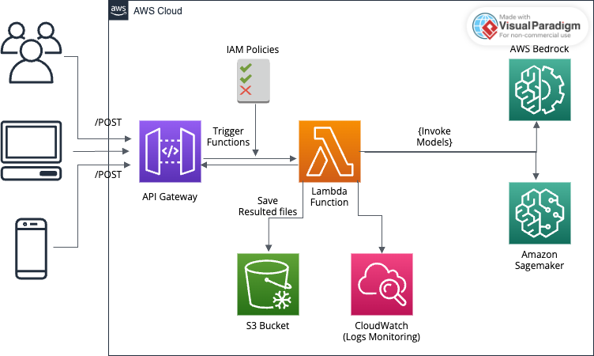

# End-to-End Blog Generation App Using AWS Bedrock & SageMaker

This project enables clients to generate blog posts on-demand using state-of-the-art models such as **Llama 3** and **Amazon Titan Text Large** in AWS Bedrock or **SageMaker**. Clients can request a blog post via an API Gateway endpoint, triggering an AWS Lambda function to invoke one of the foundational models. The generated blog post is then stored in an Amazon S3 bucket for easy access.

## 📖 Table of Contents
- [Project Overview](#project-overview)
- [Architecture and Workflow](#architecture-and-workflow)
- [Setup and Prerequisites](#setup-and-prerequisites)
- [How to Run](#how-to-run)
- [Customization](#customization)
- [Contributing](#contributing)
- [License](#license)

## Project Overview
This application allows users to generate blog posts by sending a simple API request. The request triggers a Lambda function, which uses AWS Bedrock (or optionally, SageMaker) to invoke one of the models (Llama 3 or Titan Text Large) based on the request. The generated content is then stored as a text file in an Amazon S3 bucket, where the user can access it.

## Architecture and Workflow
Here’s an overview of the workflow and architecture:

1. **API Gateway**: Receives the client request and triggers the Lambda function.
2. **AWS Lambda**: This function processes the API request and uses AWS Bedrock (or optionally, SageMaker) to invoke the text generation models.
3. **AWS Bedrock / SageMaker**: The function interacts with either AWS Bedrock or SageMaker to process the input and generate blog content.
4. **Amazon S3**: Once the content is generated, Lambda stores it in an S3 bucket as a `.txt` file.
5. **Amazon CloudWatch**: Lambda sends logs to **CloudWatch** for monitoring and tracking errors or performance issues.
6. **IAM**: Manages access permissions for Lambda to invoke the models, read/write to S3, and log to CloudWatch.

  

## Setup and Prerequisites
To set up and replicate this project, you’ll need the following AWS resources:
- **AWS API Gateway**
- **AWS Lambda**
- **AWS Bedrock** (with access to Llama 3 or Titan Text Large models) or **SageMaker**
- **Amazon S3 Bucket**

### Prerequisites:
- **AWS Account**: Ensure you have access to AWS services and are using an IAM role with permissions for Lambda, API Gateway, S3, and Bedrock/SageMaker.
- **Python 3.12**: Lambda function is written in Python, so ensure Python 3.12 is available for local development and testing.
- **Boto3 Library**: AWS SDK for Python to interact with AWS services.

### Clone the Repository
```bash
git clone https://github.com/yourusername/blog-generation-app.git
cd blog-generation-app
